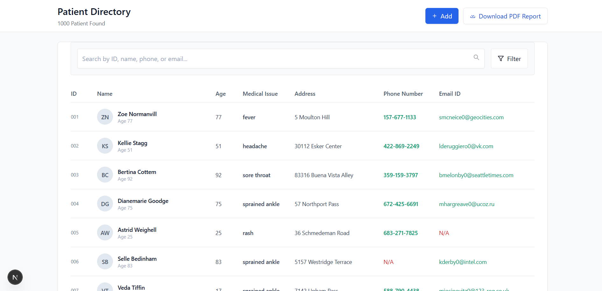
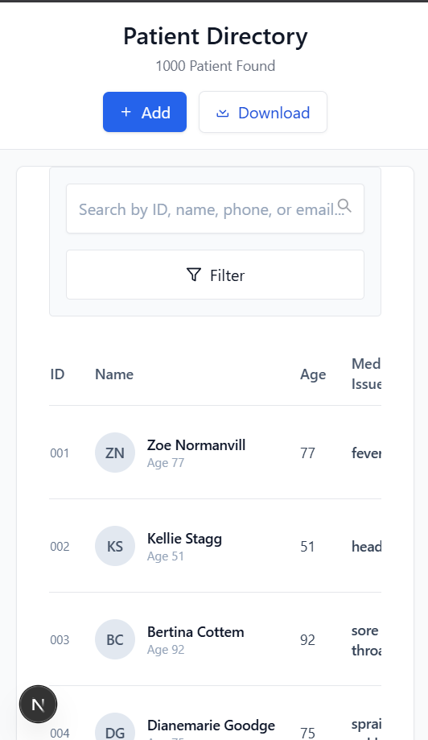

# 🏥 Patient Directory App

A complete Patient Management web application built with Next.js (App Router), TypeScript, and Tailwind CSS v3.
The app provides a clean UI to browse, search, filter, and manage patient records from a local dataset served through a custom API.

---


## Features

### Core Features

- **API Integration:** Local API endpoint (/api/patients) reads from patients.json.
- **View Patients:** Displays a paginated list of patients with details (name, age, contact, medical issue).
- **Search Patients:** Search by patient ID, name, phone, or email.
- **Filter:** Filter patients by medical issue.
- **Sorting:** Sort records by ID, Name, or Age (asc/desc).
- **Pagination:** Navigate through patient records with page controls.
- **Loading & Error Handling:** User feedback while fetching or on API errors.

### Bonus Features

- **Debounced Search:** Avoids unnecessary API calls for better performance.
- **Responsive Layout:** Works across desktop and mobile.
- **Well-structured Code:** TypeScript strict mode enabled, modular components, custom hooks.

---

## 📸 Screenshots

### Desktop View


### Mobile View


---

## Tech Stack

**Framework: Next.js (App Router)**
- Language: TypeScript
- Styling: Tailwind CSS v3
- UI Components: Custom + optional shadcn/ui
- State Management: React Hooks (useState, useEffect, custom debounce hook)

---
## 🚀 Setup & Installation

Before you begin, ensure you have [Node.js](https://nodejs.org/) (v18 or later) installed on your machine.

1.  **Clone the repository:**
    ```bash
    git clone [https://github.com/Kishan89/Patients_Directory](https://github.com/Kishan89/Patients_Directory)
    ```

2.  **Navigate to the project directory:**
    ```bash
    cd Patients_Directory
    ```

3.  **Install dependencies:**
    ```bash
    npm install
    ```

4.  **Run the development server:**
    ```bash
    npm run dev
    ```
The application will be available at `http://localhost:3000`.

## Project Structure

```markdown

📁 patient-directory/
├── app/
│   ├── api/
│   │   └── patients/
│   │       └── route.ts      # API route for handling patient data requests
│   ├── components/
│   │   ├── PatientsPage.tsx  # Main UI component for the patient directory page
│   │   └── PatientsTable.tsx # Component for rendering the data table
│   ├── hooks/
│   │   └── useDebounce.ts    # Custom hook to debounce search input
│   ├── globals.css           # Global styles for the application
│   ├── layout.tsx            # The root layout component for all pages
│   ├── page.tsx              # The entry point and main page for the app
│   └── favicon.ico           # Application's browser icon
├── data/
│   └── patients.json         # Static JSON file containing patient data
├── public/
│   └──                       # Folder for static assets (images, fonts, etc.)
├── .gitignore                # Specifies files for Git to ignore
├── next.config.ts            # Configuration for the Next.js framework
├── package.json              # Lists project dependencies and scripts
├── tailwind.config.js        # Configuration file for Tailwind CSS
└── tsconfig.json             # TypeScript compiler options

```
